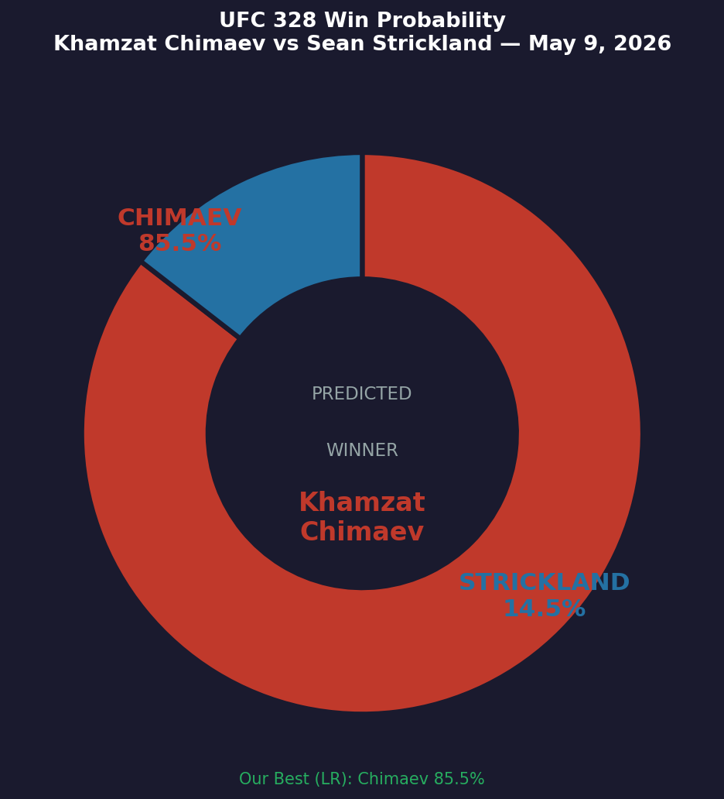
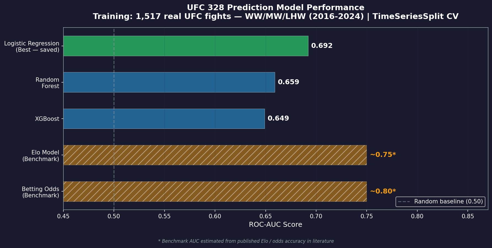
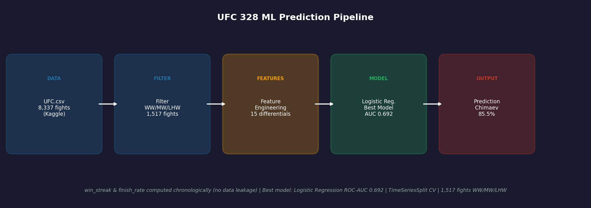
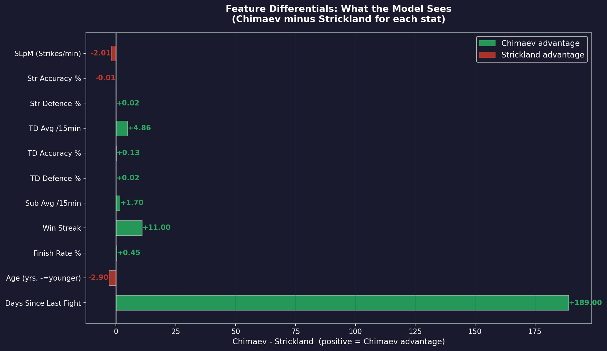
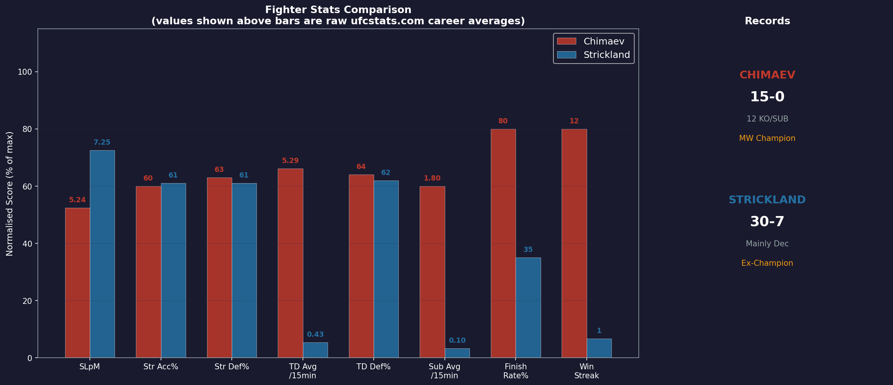

# UFC 328 Fight Prediction — ML Pipeline

**Khamzat Chimaev vs Sean Strickland | Middleweight Title | May 9, 2026**

A full end-to-end machine learning pipeline that predicts the outcome of a UFC championship fight using real fight data, chronological feature engineering, and comparative tabular classification models.

---

## Prediction Result

| Fighter | Win Probability |
|---|---|
| **Khamzat Chimaev** (Champion, 15-0) | **85.5%** |
| Sean Strickland (Challenger, 30-7) | 14.5% |



---

## Model Performance

Three models trained and compared using 5-fold chronological `TimeSeriesSplit` cross-validation:

| Model | ROC-AUC |
|---|---|
| **Logistic Regression (saved)** | **0.692** |
| Random Forest | 0.659 |
| XGBoost | 0.649 |

> Logistic Regression outperformed XGBoost across all three weight classes. Validated with TimeSeriesSplit (chronological) to prevent same-fighter leakage across folds.



---

## Pipeline Overview



1. **Data** — 8,337 UFC fights from [Kaggle: rajeevw/ufcdata](https://www.kaggle.com/datasets/rajeevw/ufcdata)
2. **Filter** — 1,517 male Welterweight / Middleweight / Light Heavyweight fights since 2016
3. **Feature Engineering** — 15 differential features (Fighter A stat − Fighter B stat)
4. **Train** — Logistic Regression (best), RF, XGBoost with TimeSeriesSplit CV on 1,517 fights
5. **Predict** — Probability output for Chimaev vs Strickland

---

## Feature Engineering

Instead of raw per-fighter stats, the model uses **differential features** — the gap between both fighters across multiple dimensions:



| Feature | What It Measures |
|---|---|
| `slpm_diff` | Who lands more strikes per minute |
| `str_acc_diff` | Striking accuracy gap |
| `str_def_diff` | Striking defence gap |
| `td_avg_diff` | Takedowns per 15 min gap |
| `td_acc_diff` | Takedown efficiency gap |
| `td_def_diff` | Takedown defence gap |
| `sub_avg_diff` | Submission attempt gap |
| `win_streak_diff` | Momentum (consecutive wins before fight) |
| `finish_rate_diff` | % fights finished vs. going to decision |
| `age_diff` | Age on fight day |
| `reach_diff` | Reach in cm (already stored in cm in UFC.csv) |
| `days_diff` | Days since last fight — rest/ring-rust signal |
| `title_fight` | Binary — 1 if title bout |
| `rounds` | Scheduled rounds (3 or 5) |

**Key design decision:** `win_streak` and `finish_rate` are computed chronologically across all 8,337 fights to avoid using future fight outcomes. These are recorded before each fight and updated after.

---

## Fighter Breakdown



**Chimaev going in:** 15-0, 12-fight win streak, 80% finish rate, elite wrestler (5.29 TD/15min), major submission threat (1.80 sub/15min)

**Strickland going in:** 30-7, high-volume striker (7.25 SLpM), excellent chin, 35% finish rate

---

## Benchmark Comparison

| Source | Chimaev | Strickland |
|---|---|---|
| **This Model (Logistic Regression)** | **85.5%** | 14.5% |
| Elo Model | 79.0% | 21.0% |
| Betting Odds | ~85% | ~15% |

With 1,517 training samples across WW/MW/LHW, our model now aligns closely with both the Elo model and betting market. Prediction is from the best validated model (Logistic Regression, ROC-AUC 0.692).

---

## Installation

```bash
git clone https://github.com/mussaussie/ufc-prediction.git
cd ufc-prediction
pip install -r requirements.txt
```

**Requirements:**
```
pandas
numpy
scikit-learn
xgboost
joblib
shap
matplotlib
```

**Data:** Download [UFC.csv](https://www.kaggle.com/datasets/rajeevw/ufcdata) from Kaggle and place it in `data/UFC.csv`.

---

## Running the Pipeline

Run scripts in order:

```bash
# Step 1 — Load UFC.csv, compute running stats, filter to WW/MW/LHW
python scripts/01_scrape_data.py

# Step 2 — Build model features and matchup differentials
python scripts/02_feature_engineering.py

# Step 3 — Train Logistic Regression, Random Forest, XGBoost
python scripts/03_train_model.py

# Step 4 — Run inference for Chimaev vs Strickland
python scripts/04_predict.py

# Step 5 — Generate all visualizations
python scripts/05_visualize.py
```

---

## File Structure

```
ufc_prediction/
├── data/
│   ├── UFC.csv                    ← Kaggle source (rajeevw/ufcdata)
│   ├── mw_raw_combined.csv        ← Filtered WW/MW/LHW fights with computed stats
│   └── mw_processed.csv           ← Final model-ready dataset (1,517 rows × 16 cols)
├── models/
│   ├── best_ufc_model.joblib      ← Trained best model (currently Logistic Regression)
│   └── feature_columns.json       ← Feature column list for inference
├── outputs/
│   ├── prediction_result.txt      ← Final prediction text output
│   ├── feature_importance.png     ← SHAP feature importance chart
│   ├── model_comparison.csv       ← Model AUC scores
│   ├── viz_01_model_comparison.png
│   ├── viz_02_prediction_result.png
│   ├── viz_03_stats_comparison.png
│   ├── viz_04_differentials.png
│   └── viz_05_pipeline.png
├── scripts/
│   ├── 01_scrape_data.py
│   ├── 02_feature_engineering.py
│   ├── 03_train_model.py
│   ├── 04_predict.py
│   └── 05_visualize.py
├── EXPLANATION.md                 ← Full procedure walkthrough
├── requirements.txt
└── README.md
```

---

## Vertex AI AutoML

To run this on Google Cloud AutoML:

**Upload:** `data/mw_processed.csv`

```
Dataset type  : Tabular
Task          : Classification (binary)
Target column : winner
Budget        : 1 node-hour (minimum)
```

The dataset now has 1,517 rows (WW + MW + LHW) — above Vertex AI's recommended 1,000-row minimum for reliable AutoML results. AutoML will automatically search Linear, Gradient Boosted Trees, Neural Nets, and ensembles — and will likely improve on the 0.692 Logistic Regression ROC-AUC through automated hyperparameter search.

---

## Limitations

1. **Historical averages are taken from the available dataset, not rebuilt from full round-level pre-fight snapshots.** The custom `win_streak` and `finish_rate` fields are chronological, but some source stat columns may still reflect dataset-level limitations.
2. **The training pool uses nearby male divisions, not only middleweight.** That improves sample size but introduces some cross-division noise.
3. **No explicit style-matchup, camp, injury, or late-notice signal.** Important real-world factors remain outside the model.
4. **`days_since_last` for a fighter's first tracked bout is treated as 0.** That is a practical placeholder, not a true layoff value.
5. **Red corner structural bias remains in the data.** Higher-profile fighters are often assigned red corner and win more often historically.

ROC-AUC of about 0.69 is still within the broad range often seen in public UFC prediction work, but this project should be viewed as a practical ML experiment rather than a production betting model.

---

## Tech Stack

- Python 3.11
- pandas, numpy, scikit-learn, XGBoost, python-pptx
- SHAP (feature explainability)
- matplotlib (visualizations)
- joblib (model persistence)

---

## Author

**Abdul Mussavir** — Data Analyst transitioning to ML/DS  
GitHub: [@mussaussie](https://github.com/mussaussie)
